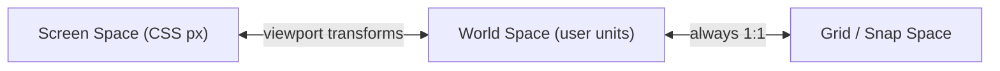
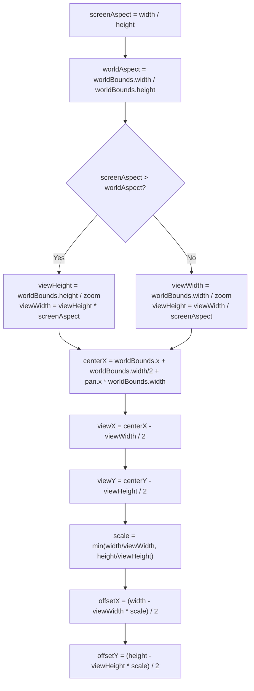
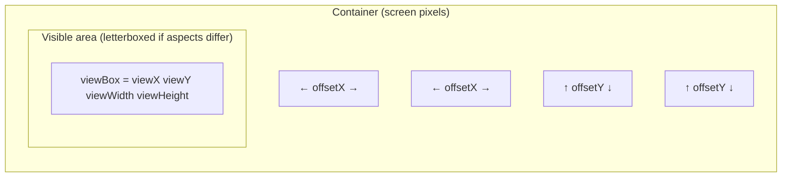
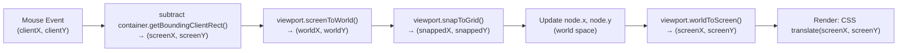
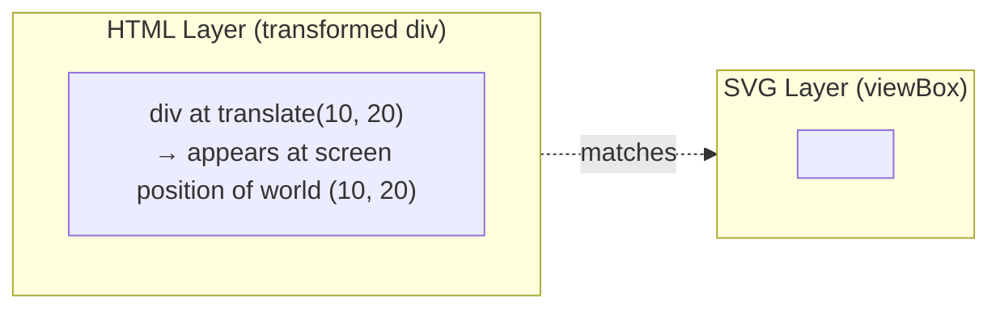
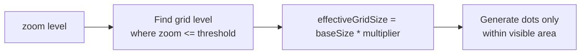
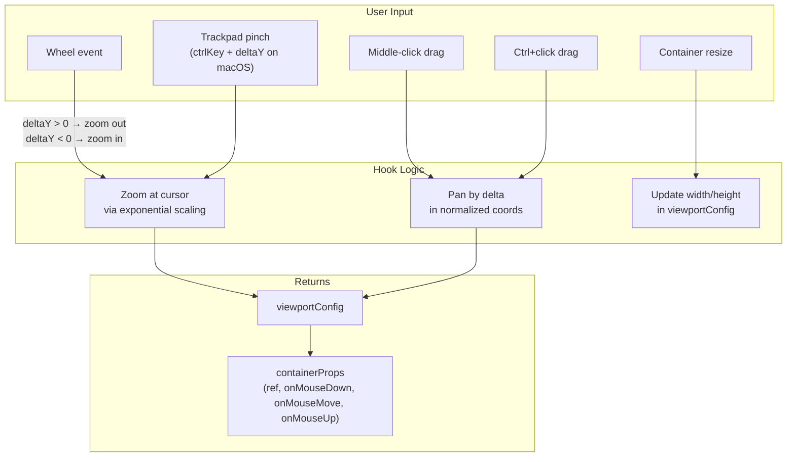

# Coordinate System & Viewport

This document explains the coordinate math that underlies every pixel Solmu renders. Understanding this is essential when building custom canvases, custom node types, or debugging alignment issues.

## Three Spaces

Solmu operates in three coordinate spaces:



| Space | Origin | Units | Usage |
|-------|--------|-------|-------|
| **Screen** | Top-left of container | CSS pixels | Mouse events, CSS transforms, container size |
| **World** | Configurable (`top-left`, `bottom-left`, `center`) | Configurable (`px`, `mm`, `in`, etc.) | Node positions, edge waypoints, connectors, all graph data |
| **Grid** | Same as world | World units | Snap positions, visual grid dots |

All graph data (node positions, edge waypoints, connector offsets) lives in **world space**. Only at the final rendering step does Solmu convert to screen pixels.

## The View Transform

The core math is in `SolmuViewport.#computeViewTransform()` in `src/viewport.ts`.

### Inputs

- `width`, `height` — container size in **screen pixels**
- `worldBounds` — extent of the world coordinate system `{ x, y, width, height }`
- `zoom` — zoom level (1 = fit worldBounds exactly to container)
- `pan` — normalized pan offset `{ x, y }`, where `0 = centered`, `0.5` = half a world bounds width

### Computing the visible world area



### Diagram: view transform geometry



The black bars (letterboxing) appear when the screen aspect ratio differs from the world bounds aspect ratio. The `offsetX` and `offsetY` center the visible area.

### Converting screen → world

```ts
screenToWorld(screenX: number, screenY: number): Point2D {
  const { viewX, viewY, scale, offsetX, offsetY } = this.#computeViewTransform();
  return {
    x: (screenX - offsetX) / scale + viewX,
    y: (screenY - offsetY) / scale + viewY,
  };
}
```

Step by step:
1. Subtract the screen offset (remove letterbox margins)
2. Divide by scale (convert screen pixels to world units)
3. Add the viewBox origin (shift to world coordinate origin)

### Converting world → screen

```ts
worldToScreen(worldX: number, worldY: number): Point2D {
  const { viewX, viewY, scale, offsetX, offsetY } = this.#computeViewTransform();
  return {
    x: (worldX - viewX) * scale + offsetX,
    y: (worldY - viewY) * scale + offsetY,
  };
}
```

This is the inverse:
1. Subtract the viewBox origin (shift relative to visible area)
2. Multiply by scale (convert world units to screen pixels)
3. Add the screen offset (add letterbox margins)

### Complete conversion pipeline



## HTML Layer Transform

The HTML layer uses the same math but expressed as a CSS `matrix()` transform. This is the critical piece that keeps HTML nodes and SVG edges aligned.

```ts
getHTMLLayerTransform(): string {
  const { viewX, viewY, scale, offsetX, offsetY } = this.#computeViewTransform();
  const e = -viewX * scale + offsetX;  // screenX where worldX = 0
  const f = -viewY * scale + offsetY;  // screenY where worldY = 0
  return `matrix(${scale}, 0, 0, ${scale}, ${e}, ${f})`;
}
```

This matrix means: a DOM element at `translate(x, y)` inside the HTML layer will appear at the exact same screen position as an SVG element at `(x, y)` in the SVG layer.



The `e` and `f` translation components encode where the world origin `(0, 0)` appears on screen after accounting for zoom, pan, and letterboxing.

## Zoom and Pan Math

### Pan is normalized

Pan values are **normalized** relative to `worldBounds`:

```ts
// pan.x = 0  → worldBounds center is at container center
// pan.x = 0.5 → shifted right by half a worldBounds width
// pan.x = -0.5 → shifted left by half a worldBounds width

const centerX = worldBounds.x + worldBounds.width / 2 + pan.x * worldBounds.width;
```

This makes pan **resolution-independent** — changing the container size doesn't shift the viewport content.

### Zoom is multiplicative

```ts
zoomIn(factor = 1.2) {
  this.#config.zoom *= factor;
}
zoomOut(factor = 1.2) {
  this.#config.zoom /= factor;
}
```

- `zoom = 1` — the world bounds fit exactly within the container (minus letterboxing)
- `zoom = 2` — zoomed in 2×, you see half the world width
- `zoom = 0.5` — zoomed out 2×, you see double the world width

### `fitToView`

```ts
fitToView(contentBounds: Bounds, margin = 0.1) {
  const zoomX = width / (contentBounds.width * (1 + margin));
  const zoomY = height / (contentBounds.height * (1 + margin));
  this.#config.zoom = Math.min(zoomX, zoomY);

  // Center content
  this.#config.pan.x = (contentBounds.x + contentBounds.width/2 - worldBounds.x) / worldBounds.width - 0.5;
  this.#config.pan.y = (contentBounds.y + contentBounds.height/2 - worldBounds.y) / worldBounds.height - 0.5;
}
```

Calculates the zoom needed to fit given content bounds plus a margin, then centers it.

## Grid System

### Adaptive visual grid

Grid dot density adapts to zoom level so the canvas never looks cluttered:



Grid levels (from `viewport.ts`):

| Zoom threshold | Multiplier | Visual density |
|----------------|------------|----------------|
| ≤ 0.05 | 200 | Ultra sparse |
| ≤ 0.1 | 100 | Very sparse |
| ≤ 0.2 | 50 | Sparse |
| ≤ 0.5 | 20 | Medium-sparse |
| ≤ 1.0 | 10 | Medium |
| ≤ 2.0 | 5 | Normal |
| ≤ 3.0 | 2 | Dense |
| ≤ 5.0 | 1 | Full density |
| ≤ 10.0 | 0.5 | Very dense |
| ≤ 20.0 | 0.2 | Ultra dense |

The visual grid size does **not** affect snapping. These are independent.

### Grid snapping

Snapping uses a **fixed world-space resolution**, independent of zoom:

```ts
snapToGrid(worldPoint: Point2D): Point2D {
  const snapSize = grid.snapSize ?? grid.size;
  return {
    x: Math.round(worldPoint.x / snapSize) * snapSize,
    y: Math.round(worldPoint.y / snapSize) * snapSize,
  };
}
```

This guarantees that:
1. A node at `(10.3, 20.7)` with `snapSize = 1` snaps to `(10, 21)`
2. Snapping is **deterministic** regardless of zoom level
3. You can have a coarse visual grid (`size: 10`) with fine snapping (`snapSize: 1`)

### Coordinate origins

The `origin` config affects how `y` values are interpreted conceptually, but the actual math in `SolmuViewport` treats all coordinates uniformly. The origin is mainly used for display formatting and for user-facing coordinate readouts.

| Origin | What it means | Typical use |
|--------|--------------|-------------|
| `top-left` | `(0,0)` is top-left, `y` increases downward | Flow charts, UML |
| `bottom-left` | `(0,0)` is bottom-left, `y` increases upward | Engineering, schematics |
| `center` | `(0,0)` is center | Math, physics |

## The `useSolmuViewport` Hook

`src/useViewport.ts` provides a higher-level React hook for managing zoom/pan via user input:



### Zoom centered on cursor

The most subtle piece of math is zooming while keeping the point under the cursor stationary:

```ts
// Before zoom: what world point is under the cursor?
const worldNormX = (fx - 0.5) / prev.zoom + 0.5 + prev.pan.x;
const worldNormY = (fy - 0.5) / prev.zoom + 0.5 + prev.pan.y;

// After zoom: what pan puts that same world point under the cursor?
const newPanX = worldNormX - 0.5 - (fx - 0.5) / newZoom;
// Same for Y
```

Where `fx` and `fy` are the cursor position as fractions of the container (0..1).

### Wheel event handling

Because React's `onWheel` is passive (cannot `preventDefault` since React 17), Solmu uses native `addEventListener` with `{ passive: false }`:

```ts
React.useEffect(() => {
  const el = containerRef.current;
  if (!el) return;
  el.addEventListener("wheel", handleWheel, { passive: false });
  return () => el.removeEventListener("wheel", handleWheel);
}, [handleWheel]);
```

This is critical for preventing page scroll when the user zooms with the mouse wheel inside the canvas.

## Common Gotchas

### 1. Screen vs world in drag handlers

Mouse events arrive in **screen pixels**. Always convert:

```ts
const worldPoint = viewport.screenToWorld(
  event.clientX - rect.left,
  event.clientY - rect.top
);
```

### 2. The HTML layer is a sibling, not a child

The HTML layer is a sibling `<div>` after the `<svg>`, not a child of the SVG. This means:
- You cannot use `<foreignObject>` — you don't need to
- Nodes are true React components, not SVG foreign objects
- CSS `z-index` within the HTML layer applies normally

### 3. Pan affects both layers automatically

Because both layers derive from the same `SolmuViewport` instance, updating pan or zoom automatically keeps them aligned. You don't need to manually sync anything.

### 4. World bounds can be larger than the viewport

You can have `worldBounds` that extends far beyond what the container shows at `zoom = 1`. The user pans/zooms to navigate. This is common for infinite-canvas-style editors.

### 5. Aspect ratio mismatches cause letterboxing

If `width/height` ≠ `worldBounds.width/worldBounds.height`, there will be empty space on two sides. This is intentional — it preserves the aspect ratio so circles stay circular and squares stay square.
