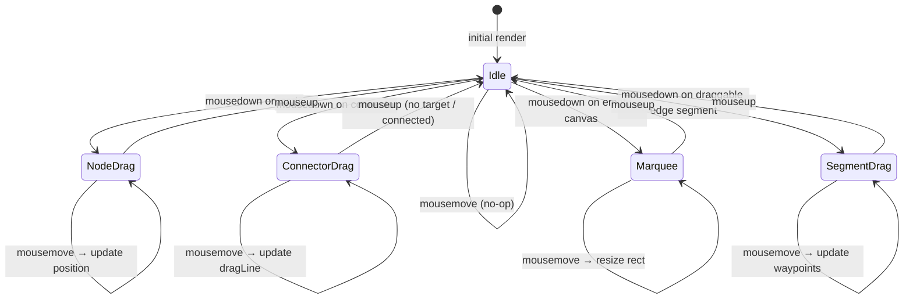
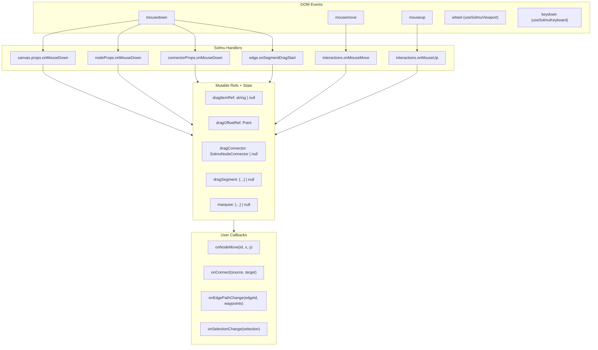
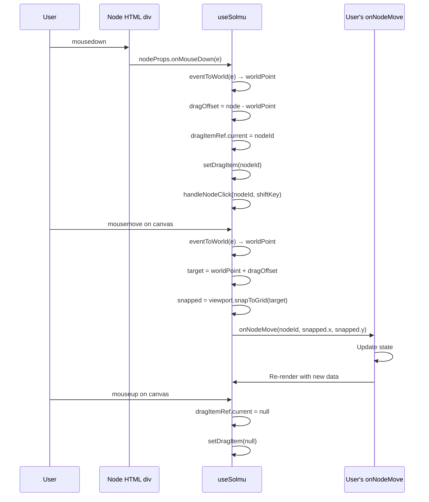
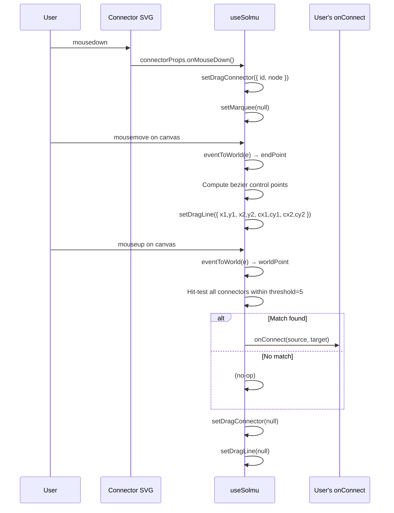
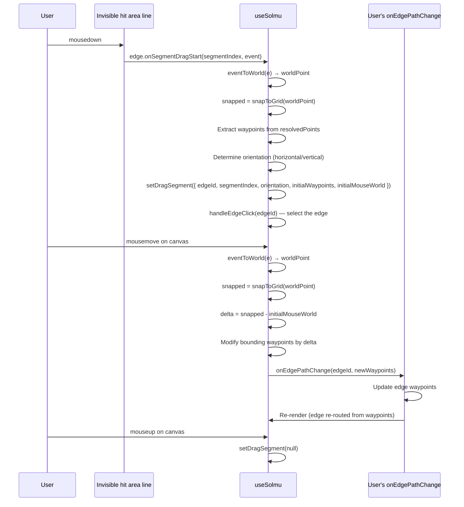
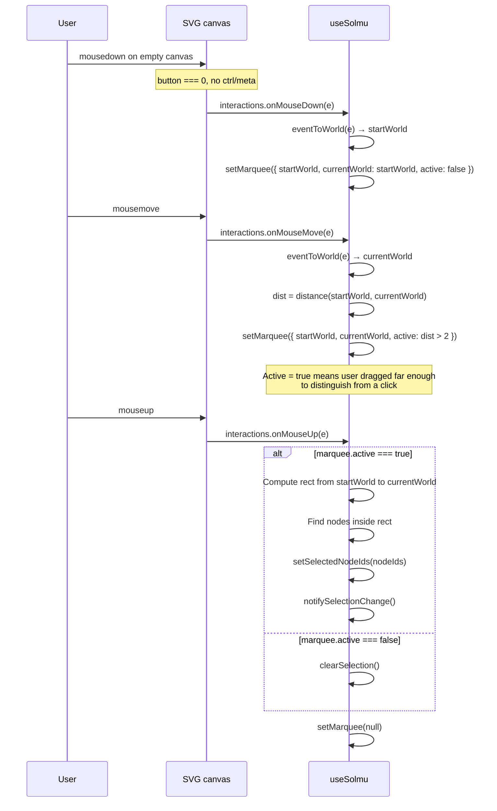
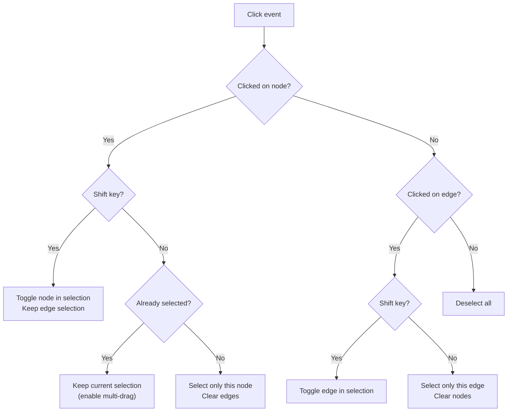
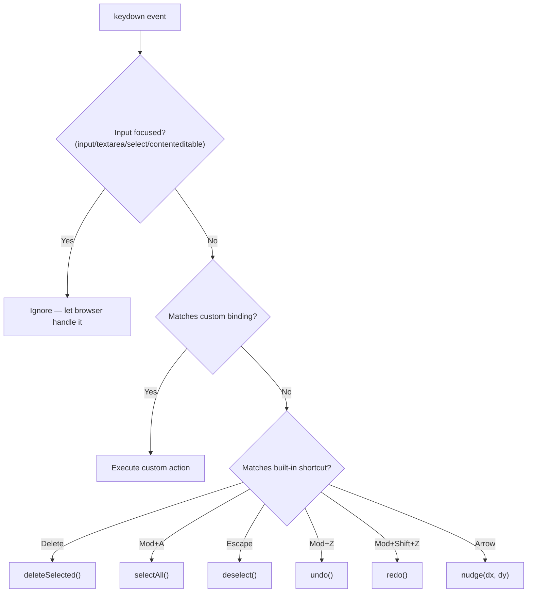

# Event Handling

This document describes the complete event flow inside Solmu: how raw DOM events are captured, routed through the interaction state machine, and transformed into user callbacks.

## Interaction State Machine

At any moment, Solmu is in exactly one interaction state. Each state determines which events are handled and what they do:



Only one state is active at a time. This is enforced by checking all related state flags in event handlers. For example, `onMouseMove` checks `dragItemRef.current`, `dragConnector`, `dragSegment`, and `marquee` and only processes the first matching one.

## Event Handler Architecture



## The `eventToWorld` Helper

Every mouse event handler converts screen coordinates to world coordinates using the same helper:

```ts
function eventToWorld(event: React.MouseEvent): Point | null {
  const rect = containerRef.current?.getBoundingClientRect();
  if (!rect) return null;
  return viewport.screenToWorld(
    event.clientX - rect.left,
    event.clientY - rect.top
  );
}
```

Critical: it uses `event.clientX - rect.left`, not `event.offsetX`. The latter is unreliable when the event target is a nested element (like a node inside the HTML layer).

## Dragging a Node



### Multi-drag

If the dragged node is part of a multi-selection, all selected nodes move by the same delta:

```ts
const deltaX = snapped.x - node.x;
const deltaY = snapped.y - node.y;

for (const selectedId of selectedNodeIds) {
  if (selectedId === dragItem) continue;
  const selectedNode = data.nodes.find((n) => n.id === selectedId);
  if (selectedNode) {
    onNodeMove(selectedId, selectedNode.x + deltaX, selectedNode.y + deltaY);
  }
}
```

### Clearing edge waypoints on node move

When a connected node moves, Solmu clears waypoints on affected edges to trigger re-routing:

```ts
if (onEdgePathChange) {
  data.edges.forEach((edge, index) => {
    if (edge.waypoints && edge.waypoints.length > 0) {
      if (movedNodeIds.has(edge.source.node) || movedNodeIds.has(edge.target.node)) {
        const edgeId = `${edge.source.node}-${edge.target.node}-${index}`;
        onEdgePathChange(edgeId, []);  // empty waypoints = re-route
      }
    }
  });
}
```

## Connector Dragging (Creating Edges)



### Hit-testing for connection completion

The connector mouseup handler (`onConnectorMouseUp`) is intentionally a no-op. The actual connection logic lives in the global `onMouseUp` and uses **position-based hit-testing**:

```ts
const threshold = 5;  // world units
outer: for (const node of data.nodes) {
  if (!node.connectors) continue;
  for (const connector of node.connectors) {
    if (node.id === dragConnector.node && connector.id === dragConnector.id) continue; // can't connect to self
    const cx = node.x + connector.x;
    const cy = node.y + connector.y;
    const dist = Math.sqrt((worldPoint.x - cx) ** 2 + (worldPoint.y - cy) ** 2);
    if (dist <= threshold) {
      onConnect(source, target);
      break outer;
    }
  }
}
```

This works around the fact that the HTML node layer blocks SVG pointer events — the target connector may never receive a `mouseup`.

### Drag line bezier math

While dragging a connector, the drag line is a cubic bezier:

```ts
const dx = endX - startX;
const controlX1 = startX + dx / 3;
const controlY1 = startY;
const controlX2 = startX + (dx * 2) / 3;
const controlY2 = endY;
```

This creates a horizontal-departure, horizontal-approach curve that looks natural for most diagram types.

## Edge Segment Dragging



### How segment dragging changes waypoints

A segment in `resolvedPoints` connects `resolvedPoints[i]` to `resolvedPoints[i+1]`. The waypoints (user-modifiable points) are the interior points `resolvedPoints[1..n-1]`.

When dragging a segment, the two waypoints that bound it are modified:

```ts
const wpIdx1 = dragSegment.segmentIndex - 1;  // lower waypoint
const wpIdx2 = dragSegment.segmentIndex;      // upper waypoint

if (dragSegment.orientation === "horizontal") {
  // Horizontal segment → drag vertically (change y)
  newWaypoints[wpIdx1].y += deltaY;
  newWaypoints[wpIdx2].y += deltaY;
} else {
  // Vertical segment → drag horizontally (change x)
  newWaypoints[wpIdx1].x += deltaX;
  newWaypoints[wpIdx2].x += deltaX;
}
```

This preserves connectivity: adjacent segments stretch or shrink to stay connected to their shared waypoints.

### Segment draggability rules

Not all segments are draggable. `computeSegments` in `src/solmu.tsx` decides:

```ts
// A segment is draggable if:
// 1. At least one endpoint is a user waypoint (not a connector start/end)
// 2. The segment is axis-aligned (not diagonal)
const hasWaypointEndpoint = (i >= 1) || (i + 1 <= resolvedPoints.length - 2);
const draggable = hasWaypointEndpoint && orientation !== "diagonal";
```

Segments touching connector endpoints are not draggable because the endpoints must stay fixed at the connector position.

## Marquee Selection



### Threshold for activation

Marquee only activates after the mouse moves more than 2 world units. This prevents accidental marquee selection when the user intended to click a node but barely missed it:

```ts
const dx = worldPoint.x - marquee.startWorld.x;
const dy = worldPoint.y - marquee.startWorld.y;
const dist = Math.sqrt(dx * dx + dy * dy);
setMarquee({
  ...marquee,
  currentWorld: worldPoint,
  active: marquee.active || dist > 2,
});
```

## Selection System

### Selection state

```ts
const [selectedNodeIds, setSelectedNodeIds] = React.useState<Set<string>>(new Set());
const [selectedEdgeIds, setSelectedEdgeIds] = React.useState<Set<string>>(new Set());
```

Using `Set<string>` makes membership checks O(1) and prevents duplicates.

### Click behavior



### Selection notification

Selection changes notify the user via callback:

```ts
function notifySelectionChange(nodeIds: Set<string>, edgeIds: Set<string>) {
  if (onSelectionChange) {
    onSelectionChange({
      nodeIds: Array.from(nodeIds),
      edgeIds: Array.from(edgeIds),
    });
  }
}
```

This is called after every selection mutation (click, shift+click, marquee, select all, deselect).

## Keyboard Shortcuts

Solmu provides `useSolmuKeyboard` (in `src/keyboard.ts`) for keyboard interactions:



### Mod key handling

`mod` means **Ctrl** on Windows/Linux and **Cmd** on macOS:

```ts
const isMac = typeof navigator !== "undefined" && /Mac|iPhone|iPad/.test(navigator.platform);
const mod = isMac ? e.metaKey : e.ctrlKey;
```

## Event Handler Wiring

### With `SolmuCanvas`

The built-in component wires everything automatically:

```tsx
<SolmuCanvas canvas={canvas} elements={elements} interactions={interactions} />
```

The component spreads `interactions.onMouseDown` on the SVG and `interactions.onMouseMove`/`interactions.onMouseUp` on the container div.

### With custom SVG

You must wire the handlers manually:

```tsx
<div ref={canvas.ref}
     onMouseMove={interactions.onMouseMove}
     onMouseUp={interactions.onMouseUp}>
  <svg {...canvas.props} viewBox={canvas.viewBox}>
    {/* render edges, nodes, etc. */}
  </svg>
</div>
```

Critical: put `onMouseMove` and `onMouseUp` on the **container div**, not the SVG. If the user's mouse leaves the SVG during a fast drag but is still inside the container, the drag must continue.

## Race Conditions & Refs

Solmu uses refs for drag state to avoid React's async state update latency:

```ts
const dragItemRef = React.useRef<string | null>(null);  // immediate access
const [dragItem, setDragItem] = React.useState<string | null>(null);  // reactive for render

function onMouseDown(event, id) {
  dragItemRef.current = id;   // set immediately
  setDragItem(id);             // trigger re-render (for isDragging visual feedback)
}

function onMouseMove(event) {
  const dragItem = dragItemRef.current;  // read latest value synchronously
  if (dragItem) { /* process drag */ }
}
```

Without `dragItemRef`, `onMouseMove` might read stale state if React hasn't flushed the state update yet. The ref guarantees the handler always sees the current drag item.

Similarly, `dragOffsetRef` stores the mouse-to-node offset at drag start so the node doesn't jump to the cursor center on the first move:

```ts
dragOffsetRef.current = {
  x: node.x - worldPoint.x,
  y: node.y - worldPoint.y,
};
```

## Summary Table

| Interaction | Trigger | State | Refs Used | Callbacks Fired |
|-------------|---------|-------|-----------|-----------------|
| **Node drag** | mousedown on node | `dragItem` | `dragItemRef`, `dragOffsetRef` | `onNodeMove` (each move), `onNodeClick` (mousedown) |
| **Connector drag** | mousedown on connector | `dragConnector`, `dragLine` | — | `onConnect` (on mouseup if hit) |
| **Edge segment drag** | mousedown on segment | `dragSegment` | — | `onEdgePathChange` (each move) |
| **Marquee select** | mousedown on empty canvas | `marquee` | — | `onSelectionChange` (on mouseup) |
| **Node click (no drag)** | mousedown + mouseup | — | — | `onNodeClick`, `onSelectionChange` |
| **Edge click** | click on edge path | — | — | `onEdgeClick`, `onSelectionChange` |
| **Canvas click** | mousedown + mouseup on empty | — | — | `onSelectionChange` (deselect) |

## Escape Key Handling

When a connector drag is active, pressing Escape cancels it:

```ts
React.useEffect(() => {
  if (!dragConnector) return;
  function handleKeyDown(e: KeyboardEvent) {
    if (e.key === 'Escape') {
      setDragConnector(null);
      setDragLine(null);
    }
  }
  document.addEventListener('keydown', handleKeyDown);
  return () => document.removeEventListener('keydown', handleKeyDown);
}, [dragConnector]);
```

This is registered dynamically — only while a connector is being dragged. The global keyboard hook (`useSolmuKeyboard`) handles Escape for deselection separately.
