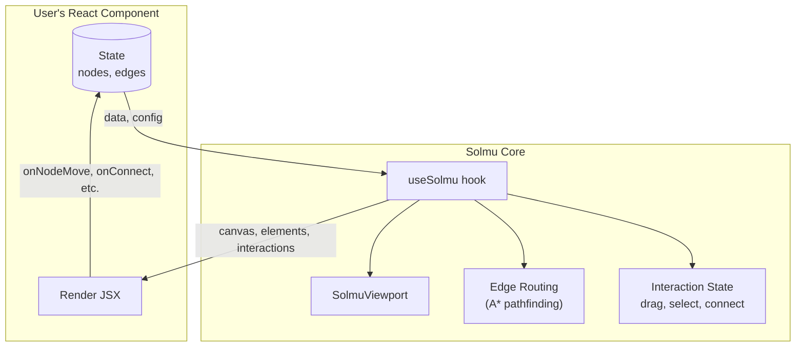
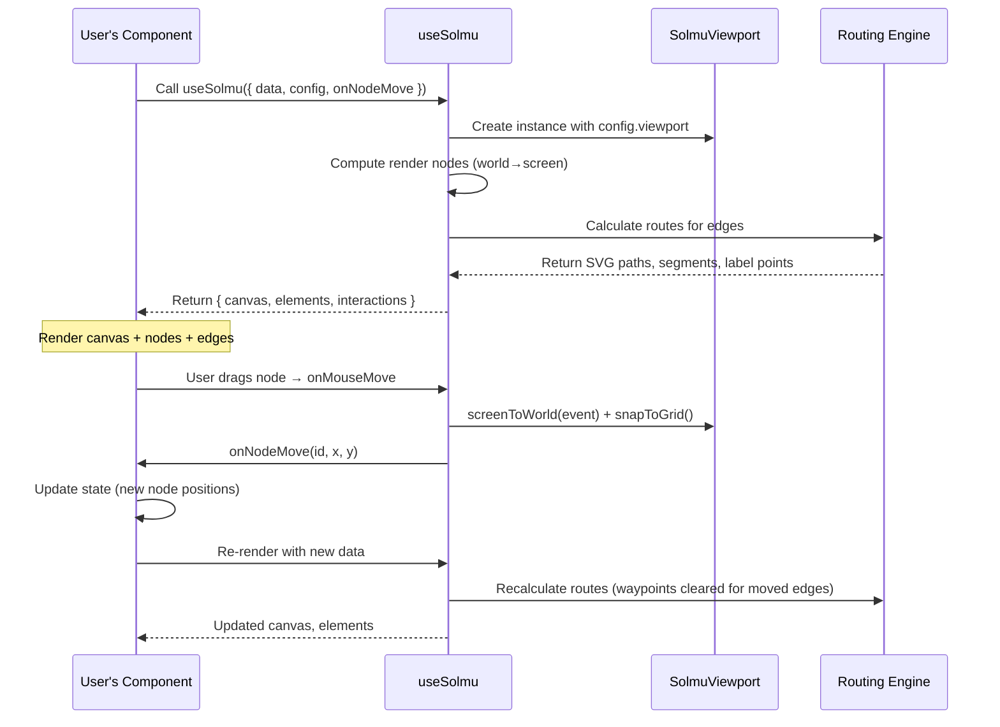
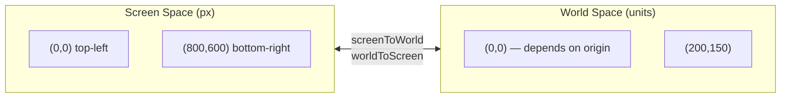
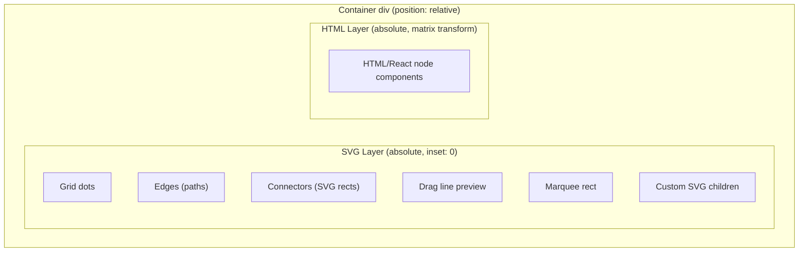
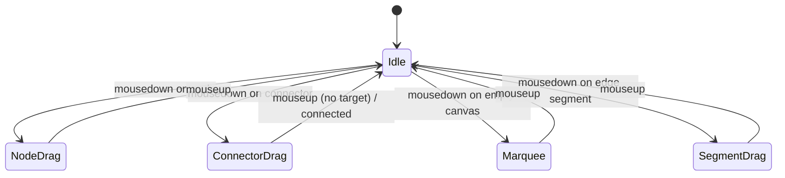
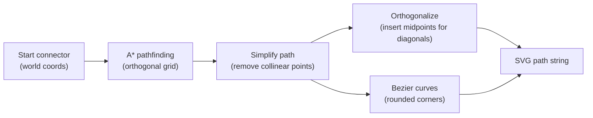

# Solmu Developer Overview

This document describes the internal architecture of **Solmu** for developers and AI agents working with the codebase. It is the starting point for understanding how the library is organized.

## What is Solmu?

Solmu is a **headless graph/diagram library for React**. It follows the inversion-of-control pattern (like TanStack Table) where:

- **The library owns the hard problems**: Viewport math, edge routing, drag state, coordinate conversions, grid snapping.
- **You own the rendering**: You provide React components for nodes and decide how to render edges, connectors, labels, and the canvas background.

## High-Level Architecture

## Module Map

| File | Responsibility | Key Exports |
|------|---------------|-------------|
| `src/solmu.tsx` | Main hook — orchestrates everything | `useSolmu` |
| `src/viewport.ts` | Coordinate transforms, grid, viewBox | `SolmuViewport` |
| `src/useViewport.ts` | React hook for zoom/pan gestures | `useSolmuViewport` |
| `src/routing.ts` | A* routing, SVG path generation | `calculateRoute` |
| `src/types.ts` | All TypeScript types | `SolmuNode`, `Edge`, `SolmuRenderNode`, etc. |
| `src/components.tsx` | Built-in `SolmuCanvas`, default renderers | `SolmuCanvas`, `DefaultEdgeRenderer` |
| `src/keyboard.ts` | Keyboard shortcut hook | `useSolmuKeyboard` |
| `src/clipboard.ts` | Copy/paste utilities | `duplicateSelection` |

## Data Flow Loop

## Two Coordinate Systems

Solmu carefully separates **screen** (CSS pixels) from **world** (your domain units, e.g. mm, inches, or abstract units).

Everything the user interacts with happens in **world space**. The viewport handles the conversion. See [Coordinate System & Viewport](coordinate-system.md) for the full math.

## Rendering Architecture

Solmu uses a **dual-layer** approach to support both SVG graphics and rich HTML content:

The SVG layer contains all graphics that must align precisely with world coordinates (edges, connectors, grid, drag lines). The HTML layer is CSS-transformed so that `1px` inside the layer equals `1 world unit`, allowing you to use regular CSS and React components for nodes while keeping them aligned with the SVG content. See [Rendering](rendering.md) for the full breakdown.

## Core Hook: `useSolmu`

`useSolmu` in `src/solmu.tsx` is the brain of the library (~680 lines). It:

1. **Creates a `SolmuViewport`** instance from `config.viewport`
2. **Manages drag state** via refs (`dragItemRef`, `dragOffsetRef`) for immediate access during mouse moves
3. **Manages selection state** (`selectedNodeIds`, `selectedEdgeIds` Sets)
4. **Handles connector dragging** (`dragConnector`, `dragLine`)
5. **Handles edge segment dragging** (`dragSegment`)
6. **Handles marquee selection** (`marquee`)
7. **Computes edge routes** on every render via `createEdgeRoute`
8. **Returns enriched render data** — nodes with `screenX/screenY`, edges with SVG `path` and `segments`

The hook intentionally keeps mutable state in refs for drag operations (to avoid React re-render lag during fast mouse moves) while the canonical state (selection, drag state) is in `useState` for reactivity.

## Event Handling State Machine

Interaction state is a simple state machine where only one primary interaction is active at a time:

See [Event Handling](event-handling.md) for the full event flow, handler wiring, and state transitions.

## Edge Routing System

Edges are routed via the `calculateRoute` function in `src/routing.ts`:

- **Orthogonal mode**: A* finds a path on a grid, then the path is simplified and forced to be axis-aligned.
- **Bezier mode**: Same A* path but corners are rendered as quadratic curves.
- **Direct mode**: Skip A*, draw a smooth cubic bezier directly between endpoints.
- **Line mode**: Legacy straight line.

When nodes move, connected edges have their waypoints cleared (via `onEdgePathChange([], edgeId)`) to force re-routing.

## Key Design Decisions

| Decision | Rationale |
|----------|-----------|
| **Headless** | Inversion of control — users control rendering, library controls math |
| **Dual-layer (SVG + HTML)** | Lets nodes be rich HTML/React while edges/connectors stay precise SVG |
| **Refs for drag state** | Prevents React re-render lag during fast mouse movements |
| **World-space for everything** | One source of truth; viewport converts to screen only at render time |
| **A* for routing** | Deterministic, handles obstacle avoidance, works for both orthogonal and bezier |
| **Edge IDs derived from index** | `\`${source.node}-${target.node}-${index}\`` — stable enough for most cases |
| **Normalized pan** | Pan is in relative units (`0.5` = half a world bounds width) making it resolution-independent |

## Where to Go Next

- **[Rendering](rendering.md)** — How the dual-layer system works, how `SolmuCanvas` assembles the DOM, and how to build custom renderers.
- **[Coordinate System & Viewport](coordinate-system.md)** — The math behind `screenToWorld`, `worldToScreen`, the view transform matrix, and grid generation.
- **[Event Handling](event-handling.md)** — The full event flow from raw DOM events to callbacks, the interaction state machine, and how selections work.
