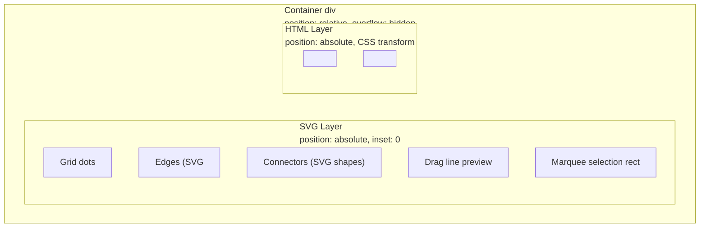
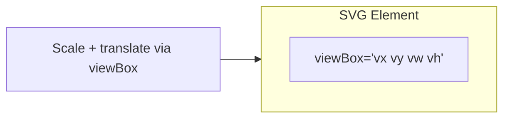
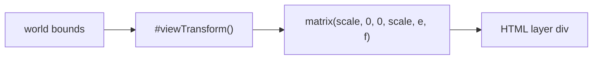
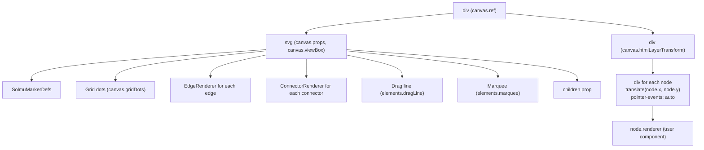
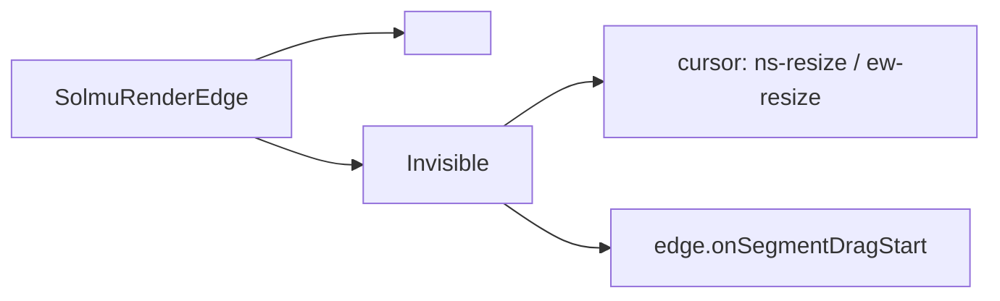
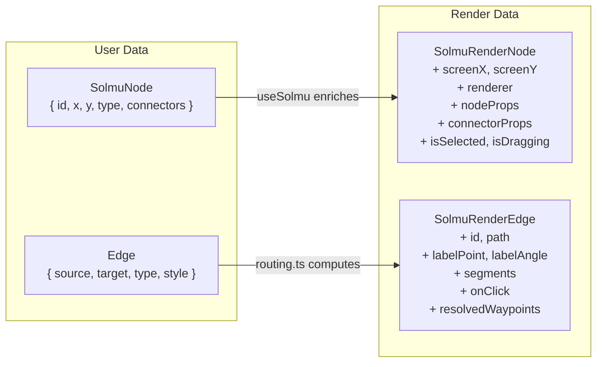
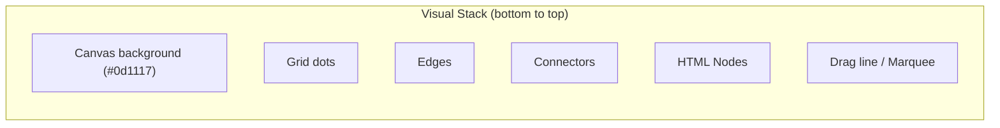

# Rendering System

This document explains how Solmu renders diagrams. It covers the dual-layer architecture (SVG + HTML), the `SolmuCanvas` component, default renderers, and how to build custom ones.

## The Dual-Layer Architecture

Solmu splits the canvas into two layers that are perfectly aligned in world space but use different rendering technologies:



### Why two layers?

| Concern | SVG Layer | HTML Layer |
|---------|-----------|------------|
| **Content** | Edges, connectors, grid, overlays, drag lines | Nodes (rich UI components) |
| **Alignment** | Uses `viewBox` to map world→screen | Uses CSS `matrix()` so px = world units |
| **Interactivity** | Pointer events on edges/connectors | Pointer events on node DOM |
| **Styling** | SVG attributes (`stroke`, `fill`) | CSS, styled-components, Tailwind, etc. |
| **Accessibility** | Title/desc elements | Standard HTML ARIA |

This separation is the key design decision that makes Solmu flexible: nodes can be any React component (forms, images, complex UI) while edges stay mathematically precise vector graphics.

## Layer Alignment Math

The SVG layer uses `viewBox` for scaling:



The HTML layer uses an explicit CSS matrix:



Both layers use the same underlying math (`#viewTransform()` in `src/viewport.ts`) to ensure edges and nodes always align:

```ts
// From viewport.ts
getHTMLLayerTransform(): string {
  const { scale, offsetX, offsetY, viewX, viewY } = this.#viewTransform();
  const e = -viewX * scale + offsetX;  // screenX of world origin
  const f = -viewY * scale + offsetY;  // screenY of world origin
  return `matrix(${scale}, 0, 0, ${scale}, ${e}, ${f})`;
}
```

Inside the HTML layer, a node at world `(x, y)` is translated by exactly `(x, y)` pixels because the matrix has already applied the scale. Connectors at `node.position + connector.offset` line up with the SVG connector shapes exactly.

## The `SolmuCanvas` Component

`SolmuCanvas` (in `src/components.tsx`) is the built-in "batteries included" renderer. It assembles the complete DOM tree:



### Node rendering inside `SolmuCanvas`

Nodes are rendered as absolutely positioned divs inside the transformed HTML layer:

```tsx
<div style={{
  position: "absolute",
  left: 0, top: 0,
  transform: `translate(${node.x}px, ${node.y}px) translate(-50%, -50%)`
           + `${node.rotation ? ` rotate(${node.rotation}deg)` : ""}`,
  pointerEvents: "auto",
}}>
  <NodeComponent {...node.nodeProps} />
</div>
```

Key points:
- `translate(${node.x}px, ${node.y}px)` — positions the node in **world units** (because the parent div's matrix transform makes 1px = 1 world unit)
- `translate(-50%, -50%)` — centers the node on its origin (nodes are positioned by their center point by convention)
- `pointerEvents: "auto"` — re-enables pointer events inside the layer (the layer wrapper sets `pointer-events: none` so mouse events pass through to the SVG beneath)

## Default Renderers

### `DefaultEdgeRenderer`

Renders an edge as an SVG `<path>` with:

- Visual path using `edge.path` (the computed SVG `d` attribute)
- Dynamic stroke color (cyan `#64ffda` when selected, green `#00e676` default)
- Hit areas: invisible wide lines over draggable segments for edge editing



### `DefaultConnectorRenderer`

Renders a 2-unit rounded rect at the connector's world position with a hover scale effect:

```tsx
<rect
  x={worldX - size / 2}
  y={worldY - size / 2}
  width={size}
  height={size}
  rx={3} ry={3}
  fill="#64ffda"
  transform={isHovered ? "scale(1.5)" : undefined}
  onMouseDown={onMouseDown}   // starts connector drag
/>
```

### `SolmuMarkerDefs`

A utility component that renders only the arrowhead markers actually needed by the current edges (so unused defs don't bloat the DOM):

```tsx
<SolmuMarkerDefs edges={elements.edges} />
// Renders <marker id="solmu-arrow"> and/or <marker id="solmu-arrow-open"> in <defs>
```

## Building Custom Renderers

### Custom node renderer

A node renderer is just a React component:

```tsx
import type { NodeRendererProps } from "solmu";

function MyNode({ node, onMouseDown, onMouseUp }: NodeRendererProps) {
  return (
    <div
      onMouseDown={onMouseDown}
      onMouseUp={onMouseUp}
      style={{
        width: 120,
        height: 60,
        background: "#e3f2fd",
        border: "2px solid #1565c0",
        borderRadius: 8,
        display: "flex",
        alignItems: "center",
        justifyContent: "center",
        cursor: onMouseDown ? "grab" : "default",
      }}
    >
      {node.id}
    </div>
  );
}
```

Important: **Always call `onMouseDown`** on your interactive element, otherwise Solmu won't know the drag started. `stopPropagation()` is called internally so the event doesn't reach the canvas and start a marquee.

### Custom edge renderer

```tsx
import type { EdgeRendererProps } from "solmu";

function MyEdgeRenderer({ edge }: EdgeRendererProps) {
  return (
    <g>
      {/* Visual path */}
      <path
        d={edge.path}
        fill="none"
        stroke={edge.isSelected ? "#3182ce" : "#333"}
        strokeWidth={0.3}
      />
      {/* Label */}
      <text
        x={edge.labelPoint.x}
        y={edge.labelPoint.y}
        textAnchor="middle"
        dominantBaseline="middle"
        fontSize={2.5}
      >
        {edge.label}
      </text>
      {/* Draggable segments (only when onEdgePathChange is provided) */}
      {edge.onSegmentDragStart && edge.segments
        .filter(s => s.draggable)
        .map(segment => (
          <line
            key={segment.index}
            x1={segment.p1.x} y1={segment.p1.y}
            x2={segment.p2.x} y2={segment.p2.y}
            stroke="transparent"
            strokeWidth={4}
            style={{ cursor: segment.orientation === "horizontal" ? "ns-resize" : "ew-resize" }}
            onMouseDown={(e) => {
              e.stopPropagation();
              edge.onSegmentDragStart!(segment.index, e);
            }}
          />
        ))}
    </g>
  );
}
```

### Custom connector renderer

```tsx
import type { ConnectorRendererProps } from "solmu";

function MyConnector({
  worldX, worldY, isHovered,
  onMouseDown, onMouseOver, onMouseUp, onMouseOut
}: ConnectorRendererProps) {
  const size = isHovered ? 3 : 2;
  return (
    <circle
      cx={worldX}
      cy={worldY}
      r={size / 2}
      fill="#64ffda"
      onMouseDown={onMouseDown}
      onMouseOver={onMouseOver}
      onMouseUp={onMouseUp}
      onMouseOut={onMouseOut}
    />
  );
}
```

## Render Data Enrichment

`useSolmu` enriches raw user data with render-ready fields:



### Node enrichment

```ts
// In useSolmu
const screen = viewport.worldToScreen(node.x, node.y);
return {
  ...node,
  renderer,                      // React component from config.renderers
  nodeProps: { node, onMouseDown, onMouseUp },
  connectorProps: [/* computed connector data */],
  screenX: screen.x,
  screenY: screen.y,
  isDragging: dragItem === node.id,
  isSelected: selectedNodeIds.has(node.id),
};
```

### Edge enrichment

```ts
const { path, labelPoint, labelAngle, resolvedPoints, sourceLabelPoint, targetLabelPoint } = createEdgeRoute(edge);
const edgeId = `${edge.source.node}-${edge.target.node}-${index}`;
const segments = computeSegments(resolvedPoints);  // hit-test segments
return {
  ...edge,
  id: edgeId,
  path,
  labelPoint,
  labelAngle,
  sourceLabelPoint,
  targetLabelPoint,
  isSelected: selectedEdgeIds.has(edgeId),
  onClick: (event) => handleEdgeClick(edgeId, event?.shiftKey),
  resolvedWaypoints: resolvedPoints,
  segments,
  onSegmentDragStart: onEdgePathChange
    ? (segmentIndex, event) => handleSegmentDragStart(edgeId, segmentIndex, resolvedPoints, event)
    : undefined,
};
```

## Connector Hit-Testing During Drag

When dragging a connector to create a new edge, Solmu doesn't rely on mouseup events reaching the target connector (because the HTML node layer blocks SVG pointer events). Instead, it does **position-based hit testing** in `onMouseUp`:

```ts
// In onMouseUp within useSolmu
if (dragConnector) {
  const worldPoint = eventToWorld(event);
  const threshold = 5;  // world units
  outer: for (const node of data.nodes) {
    for (const connector of node.connectors || []) {
      const cx = node.x + connector.x;
      const cy = node.y + connector.y;
      const dist = Math.sqrt((worldPoint.x - cx) ** 2 + (worldPoint.y - cy) ** 2);
      if (dist <= threshold) {
        onConnect(source, target);
        break outer;
      }
    }
  }
}
```

This is why `onConnectorMouseUp` is essentially a no-op — the actual connection logic lives in the global `onMouseUp`.

## Z-Index / Layer Order

The visual stacking order is determined by DOM order:

1. **SVG background** — grid dots
2. **SVG edges** — rendered first so they appear behind nodes
3. **SVG connectors** — appear on top of edges
4. **HTML nodes** — the HTML layer is a sibling after the SVG in DOM, so it stacks above
5. **SVG drag line** — rendered in SVG but appears below nodes (which are in the HTML layer)
6. **SVG marquee** — last in SVG, appears above everything in SVG layer



Because the HTML layer is a separate stacking context above the SVG layer, nodes always appear above edges, which is the expected behavior for most diagram editors.

## Performance Considerations

- **Viewport math** is cheap — just a few arithmetic ops per conversion.
- **Routing** (`calculateRoute`) can be expensive for large graphs because A* may explore many grid cells. It runs on every render, so consider memoizing your graph data if routing becomes a bottleneck.
- **Grid dots** are generated fresh on every render. The number of dots is proportional to visible area / grid spacing. At low zoom, fewer dots are shown (adaptive density).
- **Edge segments** (`computeSegments`) runs per edge on every render — it's O(n) where n = waypoints.
- **HTML layer transform** is a single CSS `transform` on a wrapper div — browsers composite this efficiently.
